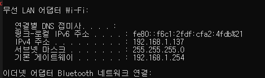
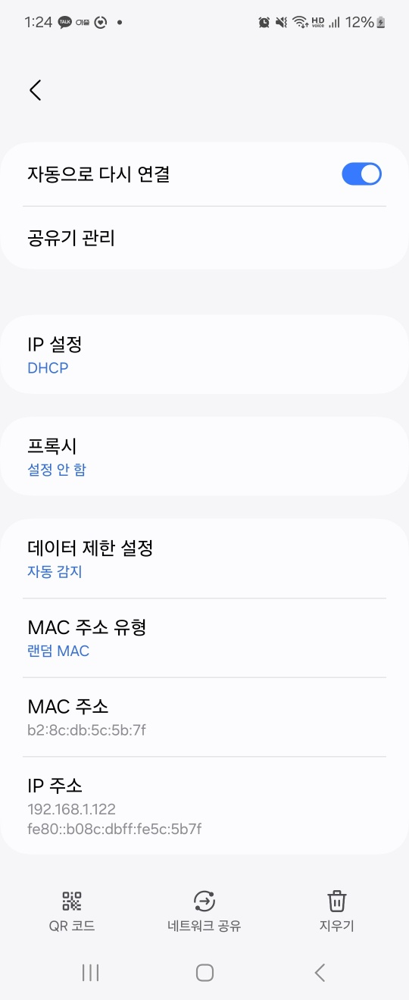
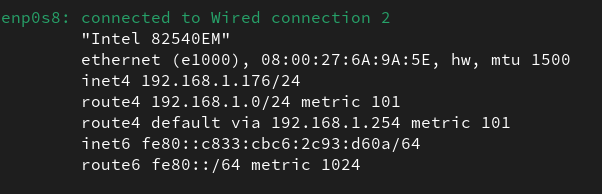
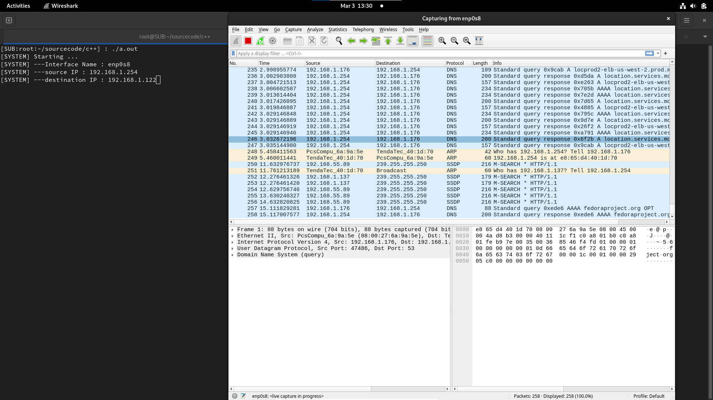
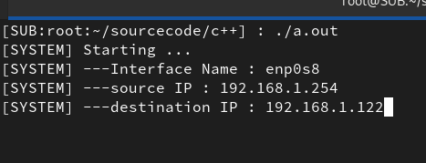
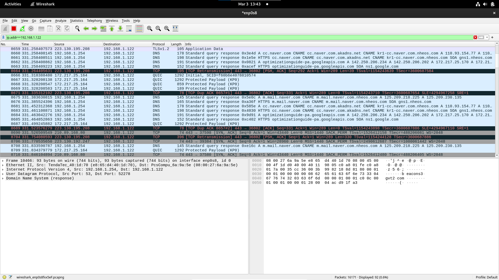

## 2. ARP Spoofing (Linux)

### 2.1. 프로그램 개요
<strong>개발 일자</strong> : 2023.12.6 ~ 2023.12.13  
<strong>OS</strong> : Fedora 38, Fedora 39  
<strong>개발도구</strong> : GCC Compiler  
<strong>프로그램명</strong> : ARPSpoofing  
<strong>사용 목적</strong> : 네트워크 보안 공격 기법 중 하나, 2계층 프로토콜인 ARP를 이용하여, 같은 네트워크 다른 사용자에 네트워크 통신 정보를 엿볼 수 있다.  
<strong>소스코드</strong> : https://github.com/yangbumki/arpspoofing  
<strong>시나리오</strong> : 
1. Linux 에서 ArpSpoofing을 통해 Windows10 네트워크 내용 가로채기
2. Linux 에서 ArpSpoofing을 통해 Galaxy Z Flip3 5G 네트워크 내용 가로채기

### 2.2. 시나리오 1번
#### 2.2.1 세팅
두 컴퓨터의 내부 네크워크 구성  

|컴퓨터|IP|  
|---|---|
|1번 컴퓨터| 192.168.32.16  
|1번 컴퓨터 가상 Linux|  192.168.32.100  
|2번 컴퓨터| 192.168.32.1  

##### 1번 컴퓨터 가상 Linux  
<image src="./screenshot/ArpSpoofingSetting1.png" align="center" border="1" title="ArpSetting1">

##### 1번 컴퓨터 
<image src="./screenshot/ArpSpoofingSetting2.png" align="center" border="1" title="ArpSetting2">

##### 2번 컴퓨터 
<image src="./screenshot/ArpSpoofingSetting3.png" align="center" border="1" title="ArpSetting3">

#### 2.2.2. 시나리오 시작
<image src="./screenshot/ArpSpoofing1.png" align="center" border="1" title="ArpSpoofing1">
  

|항목|내용|
|---|---|
|Interace|내부 네트워크 인터페이스 이름|
|Source IP|스푸핑 대상의 대상 아이피(게이트웨이 등)|
|Destination IP|스푸핑 대상의 아이피|

자신의 Mac Address 는 인터페이스 이름을 통하여 구하고 상대방에 Mac Address 주소는 대상 IP와 ARP 테이블을 통하여 구하는 방식이다. (현재는 보안상의 이유로 브로드케스트를 채용하고 있다)  
네트워크 소켓은 2계층 레이어까지 건들 수 있는 Packet Socket을 채용했다.(Window xp 이상 OS는 보안상의 이유로 3계층 레이어 소켓 중 하나인 RawSocket 부터 막아났다)

<image src="./screenshot/ArpSpoofing3.png" align="center" border="1" title="ArpSpoofing3">
  

대상 네트워크 cmd를 통하여, Ping 요청을 보낸다. Arp Spoofing 현재 네트워크 과부화를 고려하여 텀을두고 보내기에, 중간에 원래 ARP Reply로 인하여, ICMP 도달 성공하는 경우가 있다. 또한 받은 스푸핑한 네트워크 패킷을 다시 라우팅 시키는 코드를 넣지 않았기에 '요청 시간이 만료되었습니다.'가 나온다.  

<image src="./screenshot/ArpSpoofing2.png" align="center" border="1" title="ArpSpoofing2">
  

Linux - WireShark를 통하여 ICMP 정보가 들어오는 것을 확인한다.

### 2.3 시나리오 2번
#### 2.3.1. 세팅
|컴퓨터|IP|
|---|---|
|ARP Spoofing 컴퓨터|192.168.1.176/24|
|갤럭시 플립3|192.168.1.122/24|

##### Linux

##### 갤럭시 플립 3

#### 2.3.2. 시나리오 시작

##### 네트워크 인터페이스 확인 (enp0s8)
  

##### WireShark 실행

##### arpSpoofing 실행

##### 결과

플립3 192.168.1.122 -> 게이트웨이 192.168.1.254 요청한 패킷들이 Linux에서 켠 WireShark 에서 포착된다.